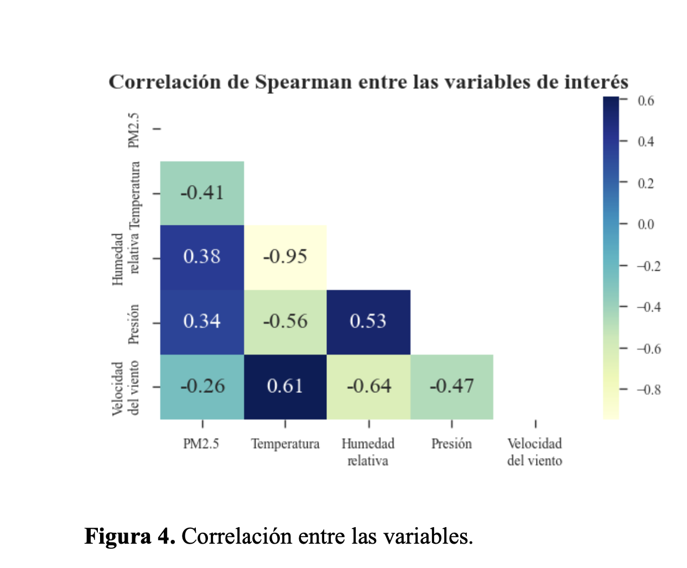
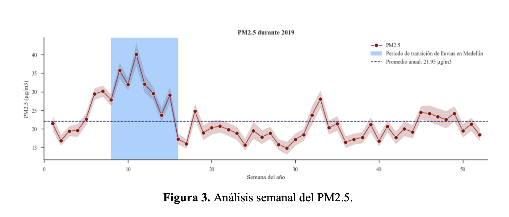
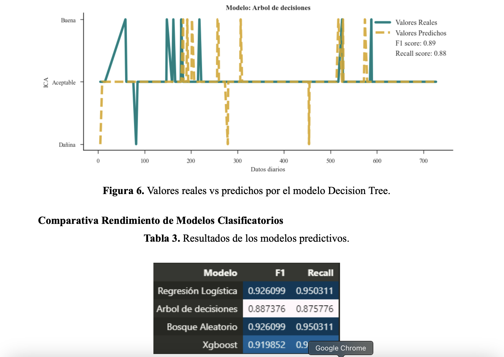

# Predicción de la Calidad del Aire en Medellín mediante Machine Learning

## Descripción del Proyecto
Este proyecto busca analizar la relación entre las concentraciones de PM2.5 y las variables meteorológicas en Medellín. Mediante técnicas de Machine Learning, se identificaron patrones y tendencias que pueden ayudar a predecir la calidad del aire y formular estrategias de mitigación de la contaminación.

## Datos Utilizados
- **Calidad del aire**: Datos históricos de PM2.5 obtenidos de estaciones de monitoreo en Medellín.
- **Variables meteorológicas**: Temperatura, humedad, velocidad del viento y presión atmosférica.

Los datos fueron recopilados del **Sistema de Alerta Temprana de Medellín y el Valle de Aburrá (SIATA)**.

## Metodología
1. **Recolección de datos**: Integración de los datos de contaminación y meteorología.
2. **Preprocesamiento**:
   - Limpieza de datos (manejo de valores nulos, unificación de formatos).
   - Análisis exploratorio para identificar distribuciones y outliers.
3. **Análisis estadístico**:
   - Análisis de correlaciones entre variables.
   - Identificación de patrones estacionales en los niveles de PM2.5.
4. **Modelado**:
   - Modelos de regresión (Linear Regression, Random Forest, XGBoost) para predecir concentraciones de PM2.5.
   - Modelos de clasificación para predecir el Índice de Calidad del Aire (ICA).

## Resultados Clave
### 1. Correlaciones entre Variables
Se observó que:
- La **temperatura** tiene una correlación negativa con PM2.5 (a mayor temperatura, menor contaminación).
- La **humedad** muestra una correlación positiva con PM2.5.
- La **velocidad del viento y la presión** tienen menor impacto en la concentración de contaminantes.

### 2. Análisis Temporal
Se identificaron picos de contaminación en las primeras 12 semanas del año, lo que sugiere la necesidad de medidas preventivas en esos periodos.

### 3. Predicción del Índice de Calidad del Aire
Se probaron modelos de clasificación y el mejor resultado se obtuvo con **Decision Tree**, con un **F1-score de 0.89**.

## Conclusiones
- Se confirmó la influencia de las variables meteorológicas en la calidad del aire.
- La predicción del ICA permite generar alertas tempranas y mejorar la toma de decisiones.
- Estos modelos pueden aplicarse en zonas sin estaciones de monitoreo, reduciendo costos de implementación.

## Autores
- Alejandro Henao Echeverri
- Erika Dayana León Quiroga
- Jhonatan Latorre Sierra
- Juan Pablo Muñoz Carmona
- Yerson Alexis Madrid Villada

## Referencias
- SIATA (https://siata.gov.co/)
- Machine Learning y contaminación del aire: https://doi.org/10.1016/j.chemosphere.2022.136353
- Documentación XGBoost: https://xgboost.readthedocs.io/en/stable/

